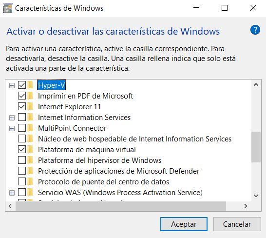

# WebODM
Install WebODM on Windows 10 using WSL2 Ubuntu for GPU support.

There are some steps that could change depending on the machine, but it would still be a guide to a possible user. I'm not completely sure of some steps, but it works for me.

Installing directly on Windows following the <a href="https://docs.opendronemap.org/installation/" target="_blank">WebODM documentation</a> is easier than these steps, but with limited resources for processing some maps, the option to use a GPU is indispensable for optimizing resource usage. I looked for other options, but I didn't find any; maybe in a later stage, software will account for GPU support on Windows.
wsl update.

  1. Activate on windows features: hyper-v, Windows Subsystem for Linux and Virtual Machine Platform
  

  2. Install the Ubuntu image (for other Linux versions, it could be different; it needs a GPU driver and Docker availability). I follow a <a href="https://docs.nvidia.com/cuda/wsl-user-guide/index.html" target="_blank">NVIDIA tutorial</a>. On a windows terminal:
  ```
  wsl.exe --install
  ```
  Ensure you have the latest WSL kernel
  ```
  wsl --update
  ```

  3. Open linux environment from windows terminal
  ```
  wsl.exe
  ```
  4. The following steps are developed inside ubuntu environment
  Remove old key
  ```
  sudo apt-key del 7fa2af80
  ```
  ```
  sudo apt update
  ```
  ```
  sudo apt install build-essential
  ```
  6. Select  <a href="https://developer.nvidia.com/cuda-downloads?" target="_blank">CUDA driver</a>, I select Operating system (linux), architecture (x86_64), distribution (WSL-Ubuntu), version (2.0), installer type runfile (local). CUDA version could cause issues but at least 12.6 and 12.8 versions works fine.
  ```
  wget https://developer.download.nvidia.com/compute/cuda/12.8.0/local_installers/cuda_12.8.0_570.86.10_linux.run
  ```
  ```
  sudo sh cuda_12.8.0_570.86.10_linux.run
  ```
  Check that nvidia driver is recognized
  ```
  nvidia-smi
  ```
  7. Install <a href="https://docs.nvidia.com/datacenter/cloud-native/container-toolkit/latest/install-guide.html" target="_blank">NVIDIA Container Toolkit</a>
  ```
  curl -fsSL https://nvidia.github.io/libnvidia-container/gpgkey | sudo gpg --dearmor -o /usr/share/keyrings/nvidia-container-toolkit-keyring.gpg \
    && curl -s -L https://nvidia.github.io/libnvidia-container/stable/deb/nvidia-container-toolkit.list | \
      sed 's#deb https://#deb [signed-by=/usr/share/keyrings/nvidia-container-toolkit-keyring.gpg] https://#g' | \
      sudo tee /etc/apt/sources.list.d/nvidia-container-toolkit.list
  ```
  ```
  sudo apt-get update
  ```
  ```
  sudo apt-get install -y nvidia-container-toolkit
  ```
  8. Install <a href="https://docs.docker.com/desktop/install/ubuntu/" target="_blank">Docker</a> for ubuntu
     - Pre-requisities
     ```
     sudo apt install gnome-terminal
     ```
     ```
     sudo apt-get update
     ```
     - Add Docker's official GPG key:
     ```
     sudo apt-get install ca-certificates curl
     ```
     ```
     sudo install -m 0755 -d /etc/apt/keyrings
     ```
     ```
     sudo curl -fsSL https://download.docker.com/linux/ubuntu/gpg -o /etc/apt/keyrings/docker.asc
     ```
     ```
     sudo chmod a+r /etc/apt/keyrings/docker.asc
     ```
     - Add the repository to Apt sources:
     ```
      echo \
        "deb [arch=$(dpkg --print-architecture) signed-by=/etc/apt/keyrings/docker.asc] https://download.docker.com/linux/ubuntu \
        $(. /etc/os-release && echo "$VERSION_CODENAME") stable" | \
        sudo tee /etc/apt/sources.list.d/docker.list > /dev/null
     ```
     ```
     sudo apt-get update
     ```
     - Install the Docker packages.
     ```
     sudo apt-get install docker-ce docker-ce-cli containerd.io docker-buildx-plugin docker-compose-plugin
     ```
     - Verify that the Docker Engine installation is successful by running the hello-world image
     ```
     sudo docker run hello-world
     ```
     - Python and git should be installed by default
  9. Install <a href="https://medium.com/@selvamraju007/how-to-install-docker-desktop-on-ubuntu-22-04-1ebe4b2f8a14" target="_blank">Docker desktop</a> from terminal
  ```
  wget https://desktop.docker.com/linux/main/amd64/docker-desktop-4.19.0-amd64.deb
  ```
  ```
  sudo apt install ./docker-desktop-*-amd64.deb
  ```
  10. Remove sudo from sudo docker run hello-world for avoid possible errors
  ```
  sudo groupadd docker
  ```
  ```
  sudo usermod -aG docker $USER
  ```
  ```
  newgrp docker
  ```
  ```
  docker run hello-world
  ```

  11. It is almost the last step. On Windows, it is necessary to add a bridge to WSL2 to be able to open the browser launched by WSL2. I follow a <a href="https://medium.com/@petrousov/how-to-brigde-windows-subsystem-for-linux-0dc55a406a3b" target="_blank">tutorial</a>
    - Open on windows Hyper-V menu
    - Once inside Hyper-V, I opened the Virtual Switch Manager. This opens the menu which allows you to create virtual NIC adapters.
    - I created an adapter called wsl-nic and connected it to my actual ethernet adapter.

  12. Add a <a href="https://learn.microsoft.com/en-us/windows/wsl/wsl-config" target="_blank">wsl2config</a> file in C:\Users\username with next content (for wsl2 is a file .wslconfig). It is supposed that networkingMode be bridged but it was deprecated but nat mode works. vmSwitch property should be the same name that NIC adapter created in previous step. The next properties are depending on the resources available in the machine but are the variables that I need to modify to avoid the Not enough memory error on WebODM 
  ```
  [wsl2]
  networkingMode=nat
  vmSwitch=wsl2_ubuntu
  
  processors=2
  memory=8GB
  swap=6GB
  ```

  13. Finally, install <a href="https://docs.opendronemap.org/installation/" target="_blank">WebODM</a>
  ```
  git clone https://github.com/OpenDroneMap/WebODM
  ```
  ```
  cd WebODM
  ```
  This step could take some minuts but if all is ok, it should recognize the gpu 
  ```
  ./webodm.sh start --gpu
  ```
  14. Open a web browser on localhost:8000 and WebODM is ready to use
